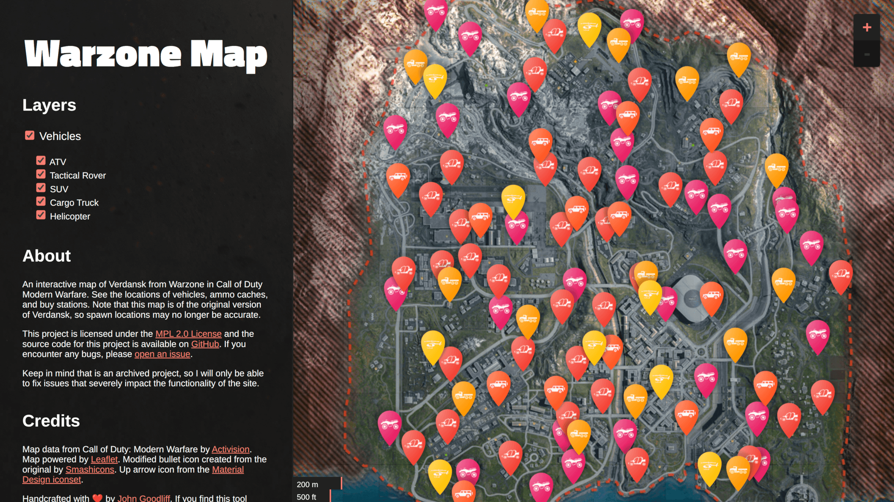

<!-- Project Header -->

  

  <h1 class="projectName">
    <a href="https://game-maps.johng.io">
      Game Maps
    </a>
  </h1>

  

    
    
    
    
    
    
  

  

    An interactive online map of Verdansk from COD Warzone
  

   

> [!IMPORTANT]
> I've marked this project as [UNMAINTAINED](https://unmaintained.tech/) because it hasn't seen an update in a while. You can still fork/download/use this project at your own risk, but I won't be able to provide support or updates.

> [!NOTE]
> This map is of the original version of Verdansk, so spawn locations may no longer be accurate.

## 👋 About

An interactive map of Verdansk from Warzone in Call of Duty Modern Warfare 2019. See the locations of vehicles, ammo caches, and buy stations.

### Screenshots

|  |
| -------------------------------------------------- |
| _Homepage_                                         |

## 🧾 License

This project is licensed under the Mozilla Public License 2.0. See [LICENSE](LICENSE) for details.

## 💕 Funding

Find this project useful? [Sponsoring me](https://johng.io/funding) will help me cover costs and **_commit_** more time to open-source.

If you can't donate but still want to contribute, don't worry. There are many other ways to help out, like:

- 📢 reporting (submitting feature requests & bug reports)
- 👨‍💻 coding (implementing features & fixing bugs)
- 📝 writing (documenting & translating)
- 💬 spreading the word
- ⭐ starring the project

I appreciate the support!
